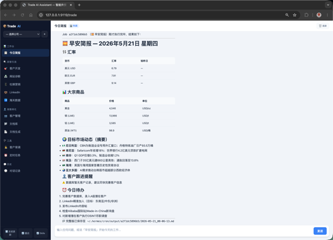
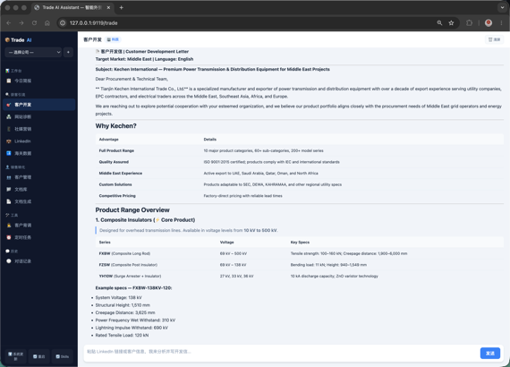

<!-- Hero -->
<div style="text-align:center; padding:2rem 1rem 1rem;">
  <h1 style="font-size:2.4rem; margin-bottom:0.2em;">🚀 Smart Trade AI</h1>
  <p style="font-size:1.2rem; color:#58a6ff; margin:0;">外贸业务员的本地 AI 助手</p>
  <p style="color:#8b949e;">在本地运行，数据留在自己电脑里</p>
  <a href="https://github.com/chefroger/smart-trade-ai" class="btn btn-primary" style="margin:0.5rem;">View on GitHub</a>
  <a href="#quick-start" class="btn" style="margin:0.5rem;">3 分钟上手 →</a>
</div>

---

<div style="text-align:center;">
  
  <p><em>客户管理 + 定时任务面板</em></p>
</div>

---

## 为什么外贸人需要这个？

| 痛点 | 不用这个工具 | 用了之后 |
|------|-------------|---------|
| 早安简报 | 每天打开 5 个网站查汇率/金价/新闻 | 自动生成，含实时汇率+大宗商品行情+客户跟进提醒 |
| 客户背调 | 手动 Google → LinkedIn → WHOIS | 一键 6 层验证：邮箱注册检测→WHOIS→制裁名单→邮箱验证→技术栈→LinkedIn |
| 开发信 | 每封手动写，客户多了记不清 | 根据客户画像自动生成，带具体痛点引用 |
| B2B 平台 | 每天登录阿里国际站/中国制造网看数据 | 定时自动检查，新询盘/待跟进报价一目了然 |
| LinkedIn | 不知道发什么内容 | AI 按周生成内容日历，轮换行业洞察/产品案例/互动提问 |
| 客户资料 | 散落在 Excel/微信/邮件里 | 统一管理，A/B/C 分级，关联文档库 |

---

<div style="text-align:center;">
  
  <p><em>AI 对话界面 — 自动调用 web_search / read_file / database 工具</em></p>
</div>

---

## 15 项专业能力

| 场景 | 能力 |
|------|------|
| 平台诊断 | 分析阿里国际站/中国制造网产品页面，输出优化建议 |
| 社媒营销 | 生成 Facebook/Instagram/TikTok/YouTube 内容日历 |
| LinkedIn 运营 | Profile 优化 + 内容策略 + InMail 模板 |
| 海关数据 | 分析进出口数据，筛选高价值采购商 |
| 客户开发 | 根据目标市场+产品生成开发信和跟进序列 |
| 客户管理 | A/B/C 分级、详情面板、文档库关联 |
| 文档分析 | 读取本地 PDF/Word/Excel/PPT，AI 自动解析 |
| 商务文档生成 | 一键生成报价单、PI、合同（DOCX/XLSX/PPTX） |
| 报价谈判 | 基于产品知识库和客户画像给出谈判策略 |
| 客户背调 | 6 层验证：邮箱→WHOIS→制裁→邮箱验证→技术栈→LinkedIn |
| 每日简报 | 实时汇率+大宗商品+市场新闻+客户跟进提醒 |
| 定时任务 | 工作日自动化：早报/开发信/社媒/每日总结 |
| 对话记录 | 按公司隔离的聊天记忆，支持搜索/回溯 |
| Skill 生成器 | 用自然语言描述需求，自动生成新 skill 并注册到系统 |

---

## <a id="quick-start"></a>3 分钟上手

### 一键脚本（推荐）

```bash
curl -fsSL https://raw.githubusercontent.com/chefroger/smart-trade-ai/main/scripts/install.sh | bash
```

脚本自动完成：Python 环境检查 → Hermes Agent → Trade 安装 → 15 个 skills → 数据库初始化。

> 如果你想先审查脚本：
> ```bash
> curl -fsSLO https://raw.githubusercontent.com/chefroger/smart-trade-ai/main/scripts/install.sh
> less install.sh       # 审查后
> bash install.sh
> ```

### 手动安装

**前置条件**：Python >= 3.11 · Git · LLM API Key（DeepSeek / OpenAI / Anthropic 等）

```bash
# 1. 安装 Hermes Agent（AI 引擎）
git clone --branch main https://github.com/NousResearch/hermes-agent.git ~/.hermes/hermes-agent
cd ~/.hermes/hermes-agent && pip install -e "."

# 2. 配置 LLM
hermes setup

# 3. 安装 Smart Trade AI
git clone --branch main https://github.com/chefroger/smart-trade-ai.git ~/.trade/foreign-trade-assistant
cd ~/.trade/foreign-trade-assistant && pip install -e "."

# 4. 安装 skills 并启动
install-trade-skills
python server.py
# → 浏览器打开 http://127.0.0.1:9119/trade
```

---

## 数据安全

- **业务数据默认存储在本地**（`~/.trade/`），不上传任何服务器
- 如使用 **Ollama 等本地模型**，可实现完整本地运行，数据完全不出电脑
- 如使用 **OpenAI / Anthropic / DeepSeek 等云端 LLM**，用户输入和必要上下文会发送至所选服务商——不包含客户身份信息
- 多公司数据隔离（`X-Company-ID` header）
- 绑定 `127.0.0.1`，仅本机浏览器可访问
- **升级前自动备份数据库**到 `~/.trade/backups/`

---

## 技术栈

| 层 | 技术 |
|----|------|
| AI 引擎 | [Hermes Agent](https://github.com/NousResearch/hermes-agent)（MIT 开源） |
| 后端 | FastAPI + SQLite + uvicorn |
| 前端 | 原生 JavaScript SPA（单文件，零构建工具依赖） |
| LLM | 兼容 OpenAI / Anthropic / DeepSeek / MiniMax / Ollama 等 |
| 文档解析 | PyMuPDF / python-docx / openpyxl / python-pptx |

---

## 联系作者

<div style="text-align:center;">
  
  <p>扫码添加微信，备注「Trade」</p>
  <p>商务合作或技术支持请发邮件至 <a href="mailto:lauroge@gmail.com">lauroge@gmail.com</a></p>
</div>

---

<p style="text-align:center; color:#8b949e;">
  Smart Trade AI — 外贸业务员的本地 AI 助手<br>
  <a href="https://github.com/chefroger/smart-trade-ai">GitHub</a> ·
  <a href="https://github.com/chefroger/smart-trade-ai/releases">Releases</a> ·
  <a href="https://github.com/chefroger/smart-trade-ai/blob/main/LICENSE">MIT License</a>
</p>
